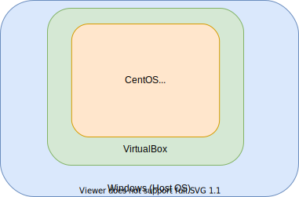
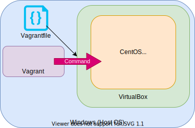

# Vagrantとは

VagrantはVirtualBoxなどを利用した仮想環境を作るソフトウェアです。

## メリット

Vagrantを使用することで以下のメリットが上げられます。

- 仮想化ソフトをCLIで操作できる
- 環境をソースコードで保持できる(IaC)
- コマンド１つで環境構築が完了し、自動化が実現できる

### 仮想化ソフトをCLIで操作できる

まず、VagrantはWindows/Mac/Linuxなど様々なOSで使用することが出来ます。  
Vagrantを使用することで、仮想化ソフトをCLIで操作することが可能になります。

VirtualBox/VMWare/libvert/Openstackなど様々なプラットフォームに対応しています。

### 環境構築の自動化

例えば、WindowsでVirtualBoxを使用してCentOSを作成する場合、以下のような構成になります。

#### Vagrantを使用しない場合

以下の手順を手動で実施して仮想マシンを構築する必要があります。

1. OSのISOイメージをWindowsにDL
2. VirtualBoxを操作してISOイメージの読み込み
3. OS定義(CPU,Memory,Hostname,Timezone...)
4. OS起動
5. ミドルウェアの構築

#### Vagrantを使用した場合

Vagrantを使用することで、以下の手順を実施するだけで自動で仮想マシンが構築されます。

1. `Vagrantfile`を用意する
2. `vagrant up`コマンドを実行する
